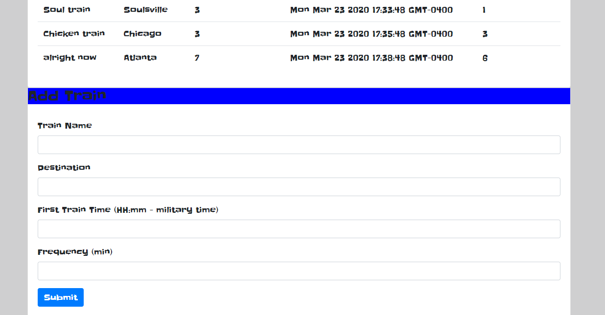

# Train-Scheduler

# Live Page

https://davidmstanleyjr.github.io/Train-Scheduler-GH-Pages/

# Description

This is my train scheduler app that I built for my bootcamp. I'm utilizing firebase to store information about train times. The train data that is generated is supposed to remain visible after the page is refreshed.

# Issues

 I had trouble getting the arrival times for each train. Some of the times would pop up "NAN". I refactored and was fine.

 # Screenshots

